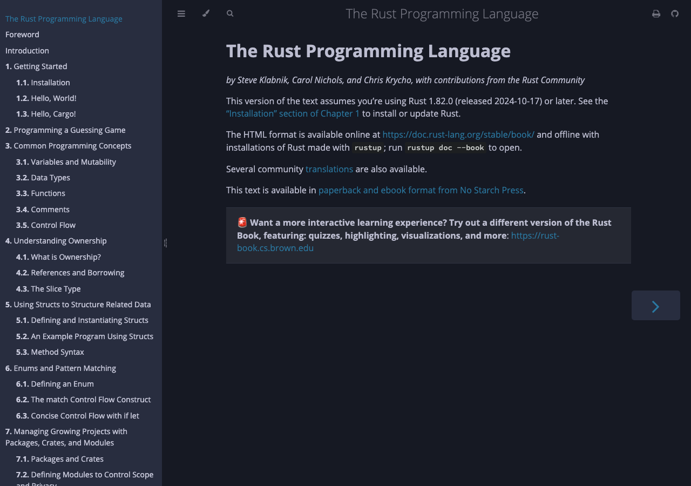

# Introduction to Embedded Rust

> This is a fork of [ShawnHymel/introduction-to-embedded-rust](https://github.com/ShawnHymel/introduction-to-embedded-rust).
> All course content and the original development environment are the work of [Shawn Hymel](https://github.com/ShawnHymel).
> This fork only adjusts the `Dockerfile` so the image builds on the pinned Rust 1.85.0 toolchain (see [Build notes](#build-notes)).

## Getting Started

Build the Docker image:

```sh
docker build -t env-embedded-rust  .
```

To run:

Linux, macOS, Windows (PowerShell):

```sh
docker run --rm -it -p 3000:3000 -v "$(pwd)/workspace:/home/student/workspace" -w /workspace env-embedded-rust
```

On startup the container serves [The Rust Book](https://doc.rust-lang.org/book/)
locally via `mdbook` at [http://localhost:3000](http://localhost:3000):



## Initialize rustlings

If you would like to practice rust with the official [rustlings](https://github.com/rust-lang/rustlings) exercises, you should navigate to the *workspace/* directory (in the container) and initialize *rustlings*:

```sh
cd /home/student/workspace
rustlings init
```

To start *rustlings* or pick up where you left off:

```sh
cd /home/student/workspace/rustlings
rustlings --manual-run
```

> **Note**: by default, *rustlings* uses *rust-analyzer* to watch for file changes to check if your code works or not. This sometimes struggles in a container, so I recommend using `--manual-run` to disable this feature. It just means you need to press `r` in the *rustlings* prompt when you want to check your code.

## Build notes

The base image pins the Rust toolchain to `1.85.0` (`rust:1.85.0-bookworm`).
Installing `mdbook` without a version constraint pulls the latest release, which
now requires a newer compiler and breaks the build:

```
error: cannot install package `mdbook 0.5.3`, it requires rustc 1.88.0 or newer,
while the currently active rustc version is 1.85.0
```

To keep the build working on Rust 1.85.0, the `Dockerfile`:

- Pins `mdbook` to **0.4.52** via a `MDBOOK_VERSION` build arg (0.4.52 supports rustc 1.82+).
- Installs `mdbook` in its own layer with `--locked`, so its transitive
  dependencies (e.g. the `icu_*` and `idna` crates) stay on the versions in
  mdbook's bundled `Cargo.lock` rather than resolving to newer ones that raise
  the minimum supported rustc past 1.85.0.

```dockerfile
RUN cargo install --locked mdbook@${MDBOOK_VERSION}
```

If you bump the base image to Rust 1.88.0 or newer, you can drop the pin and the
`--locked` flag and install the latest `mdbook` directly.

## License

All software in this repository, unless otherwise noted, is licensed under the [MIT license](https://opensource.org/licenses/MIT).

```
Copyright 2025 Shawn Hymel

Permission is hereby granted, free of charge, to any person obtaining a copy of 
this software and associated documentation files (the “Software”), to deal in 
the Software without restriction, including without limitation the rights to 
use, copy, modify, merge, publish, distribute, sublicense, and/or sell copies of
the Software, and to permit persons to whom the Software is furnished to do so, 
subject to the following conditions:

The above copyright notice and this permission notice shall be included in all 
copies or substantial portions of the Software.

THE SOFTWARE IS PROVIDED “AS IS”, WITHOUT WARRANTY OF ANY KIND, EXPRESS OR 
IMPLIED, INCLUDING BUT NOT LIMITED TO THE WARRANTIES OF MERCHANTABILITY, FITNESS
FOR A PARTICULAR PURPOSE AND NONINFRINGEMENT. IN NO EVENT SHALL THE AUTHORS OR 
COPYRIGHT HOLDERS BE LIABLE FOR ANY CLAIM, DAMAGES OR OTHER LIABILITY, WHETHER 
IN AN ACTION OF CONTRACT, TORT OR OTHERWISE, ARISING FROM, OUT OF OR IN 
CONNECTION WITH THE SOFTWARE OR THE USE OR OTHER DEALINGS IN THE SOFTWARE.
```
